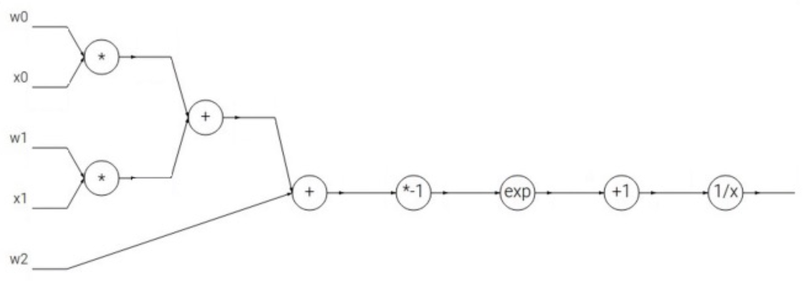

# Nural Network: Backpropagation

Calculating gradient.

## Backpropagation

Consider a function as follows:

$$
f(x, y, z) = (x + y)z
$$

Could be described as a graph like:

```bash
x ----------
            + --------> q ---------
y ----------                      |
                                  * -----------> f -------> output
                                  |
z ---------------------------------
```

Using this graph, we can implement **forward pass** to calculate a output.

For example, let $x = -2, y = 5, z = -4$, the forward pass will be like:

```bash
-2 ---------
            + ----------> 3 ---------
5 ----------                        |
                                    * ----------> -12 -------> output
                                    |
-4 ----------------------------------
```

If we want to calculate the gradient of each variable:

$$
\frac{\partial f}{\partial q} = z \quad \frac{\partial f}{\partial z} = q \quad \frac{\partial q}{\partial x} = 1 \quad \frac{\partial q}{\partial y} = 1
$$

Using **chain law**:

$$
\frac{\partial f}{\partial x} = \frac{\partial f}{\partial q} \cdot \frac{\partial q}{\partial x}
$$

But if the function is too complecated to using **chain law**, we can not calculate easily. So using backward pass to calculate the gradient:

```sh
(-2, -4) ----
            + -------> (3, -4) ------
(5, -4) -----                       |
                                    * ----------> (-12, 1) -------> output
                                    |
(-4, 3) -----------------------------
```

Using this algorithm, we can only concentrate ont the local gradient and the upstream gradient.

Another example:

$$
f(w, x) = \frac{1}{1 + e^{-(w_0x_0 + w_1x_1 + w_2)}}
$$

the computational graph is:

{ width=100% }

## Patterns in gradient flow

