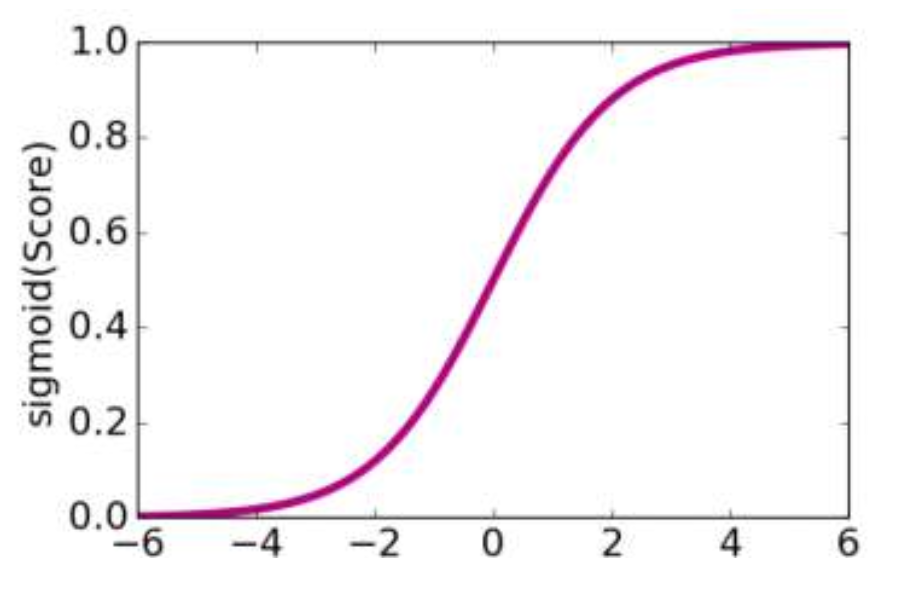

# Linear Model

This is about classification task.

## Classification Task

Find out the right class of items.

### Analyzing sentiment

We wish we could judge the mood of a sentence. For example, the sentence is *Today' weather is good*, we can infer that the mood is possitive. The input of model will be a sentence, and the output is either $+1$ or $-1$, former means possitive, after means negative.

## Linear classifiers

Consider a simple linear classifier:

$$
\begin{align*}
	&\text{Score}(\mathbf{x}) = \text{weighted sum of features of sentence}\\
	&\text{if}\quad \text{Score} > 0: \quad \hat{y} = +1\\
	&\text{else}\quad \text{Score} < 0: \quad \hat{y} = -1
\end{align*}
$$

There is a example of linear classifier: word count.

<figure markdown>
|       Feature       | Coefficient |
| :-----------------: | :---------: |
|        Good         |     1.0     |
|        Great        |     1.2     |
|       Awesome       |     1.7     |
|         Bad         |    -1.0     |
|      Terrible       |    -2.1     |
|        Awful        |    -3.3     |
| Restaurant, We, You |     0.0     |
</figure>

The input is: _Susan is **great**, the food is **awesome**, but the service is **terrible**._ We can calculate the score of input:

$$
\text{Score} = 1.2 \times 1 + 1.7 \times 1 -2.1 \times 1 = 0.8 > 0 \implies \hat{y} = +1
$$

Indicate that this comment is a possitive review.

More generally, we can denote the model like:

- **Model**: $\hat{y}_i = \text{sign}(\text{Score}(x_i))$
- **Score**: $\text{Score}(x_i) = \sum_\limits{i = 0}^{n}w_i h_i(x_i)$

The $h(x)$ is a mapping function that gives the value of input. For instance, in above example, $h(\text{Awful}) = -3.3$. $\mathbf{w}$ is the weights of features, it could be the counts of words.

## Class probability

Thus far, we've outputted a prediction of $+1$ or $-1$, but how sure is our model of its prediction?

## Logistic Regression

This model is a linear model, it trans the score into possibility using **logistic function**.

### Logistic Function

Logistic function a.k.a sigmoid function:

$$
\text{Sigmoid}(\text{score}) = \frac{1}{1 + e^{-\text{Score}}}
$$

It maps the score into $0 \sim 1$, which could be seen as a possibility.

{ width=60% }

### Optimization

For a linear regression model, we choosen to use MSE to optimize the model. For logistic regression, we want to find out the best coefficients.

#### Find best coefficient

We want to find a $\mathbf{w}$ makes:

$$
P(y = -1 | \mathbf{x, w}) = 0 \qquad P(y = +1 | \mathbf{x, w}) = 1
$$

Consider the likelihood estimation:

$$
\mathcal{L}(\mathbf{w}) = \Pi_{i \in D}P(y_i | x_i \mathbf{w})
$$

Maximize the likelihood over all possible $\mathbf{w}$.

#### Gradient ascent for logistic regression

## Linear classifier: overfitting

