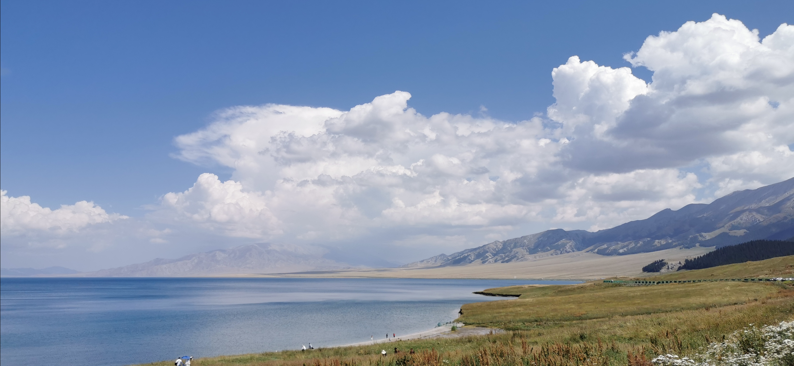
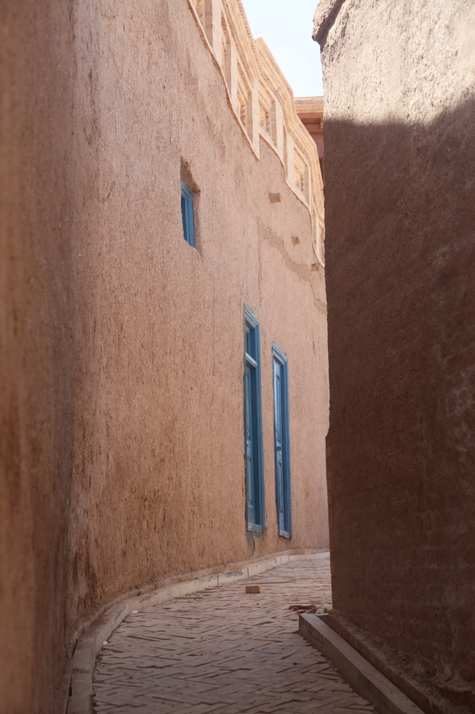

# 照片墙

诸位请坐，我们赏赏美景。

???+ quote "卞之琳"
    你站在桥上看风景，看风景的人在楼上看你，明月装饰了你的窗子，你装饰了别人的梦。

## 大西洋的最后一滴眼泪：赛里木湖

- { width=80% align=right}

    第一次去赛里木湖，站在湖边极目远眺，湖水的颜色像是染缸，完全没有一丝杂质。清风拂万里，看淡云舒卷，可谓人间绝色也。

## 葡萄美酒夜光杯：喀什

- { width=40% align=left}
    
    新疆，喀什，高台民居的一条小巷。我背着包，挎着相机远远地走同行的家人的后方。一个小姑娘拈着裙子从我面前跑过，走到巷子口，询问地看着远方的父亲。
    
    “再往里些！”背着包的父亲说。于是她转身又往里走了一段，然后转回头来看着父亲。

    “再往里点儿。”女孩儿父亲的北京口音让我感到又些亲切，于是我也停下来，注视着他们。

    “看到那块儿砖了么？就站在那儿就行，丫头。”于是小女孩儿跑到了砖旁边。

    “好嘞，你等着哈。”父亲终于端起相机拍了起来。

    等他们走后，我走到小孩儿父亲刚刚站立的位置，用同样的姿势拍了这张照片。我喜欢极了。

## 天下第一山：黄山

- 

    为了看黄山的猴子观海，我们硬这头皮不要下山，结果遇到了暴雨，我们一行人都没有遮雨的装备。为了给弟弟和妈妈买雨衣，我淋着雨
    在山上狂奔，暴雨浇透了我的所有衣物，雷声近地好像就在我的头顶。灰溜溜走到下山的索道前，雨停了，天边升起两道彩虹。

